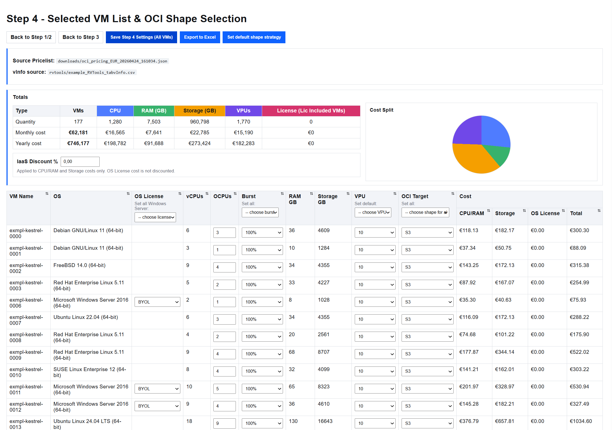

# VMW2OCI Estimator

This tool helps estimate OCI compute and storage costs from VMware inventory data.
It uses RVTools exports (vInfo data) to map virtual machines to OCI Compute shapes,
apply pricing from OCI price list data, and generate a Step 4 costing spreadsheet.

## High-Level Purpose

- Ingest RVTools VM inventory output (CSV or XLSX with vInfo content) (https://www.dell.com/en-us/shop/vmware/sl/rvtools)
- Map VMware VM profiles to OCI target shapes and OCPU/RAM/VPU settings
- Load OCI pricing data and estimate monthly costs
- Export detailed cost calculations to Excel for review and planning

## Installation

### Prerequisites

- Python 3.10+ (Python 3.13 also works)
- `pip` package manager

### Setup

1. Open a terminal in the project root:
   - `c:\oci\vmw2oci_v2-example`
2. (Recommended) Create and activate a virtual environment:
   - Windows PowerShell:
     - `python -m venv .venv`
     - `.\.venv\Scripts\Activate.ps1`
   - Windows Command Prompt (`cmd.exe`):
     - `python -m venv .venv`
     - `.venv\Scripts\activate.bat`
   - Mac/Linux shell:
     - `python3 -m venv .venv`
     - `source .venv/bin/activate`
3. Install dependencies:
   - `pip install -r requirements.txt`

## Usage

1. Start the app:
   - Windows PowerShell / Windows Command Prompt: `python app.py`
   - Mac/Linux shell: `python3 app.py`
2. Open your browser at:
   - `http://127.0.0.1:5000`
3. In the UI:
   - Download/select OCI pricing data (Step 1)
   - Select your RVTools export file (Step 2)
   - Select target VMs from vInfo data (Step 3)
   - Configure OCI shape/OCPU/burst/VPU and export costing Excel (Step 4)

### OCI Price List Source

- Step 1 automatically downloads OCI list pricing from Oracle's documented list-pricing API endpoint.
- Oracle API reference: https://docs.oracle.com/en-us/iaas/Content/Billing/Tasks/signingup_topic-Estimating_Costs.htm#accessing_list_pricing

## Data Privacy

- No customer VM inventory or costing data is sent to any cloud service by this tool.
- All generated files, state, and exports are stored and processed locally on your machine.

## Notes

- RVTools input files should be placed under `rvtools/` (or selected from discovered files).
- Downloaded OCI price lists are saved under `downloads/`.
- Session/state snapshots are saved under `downloads/app_state/`.
